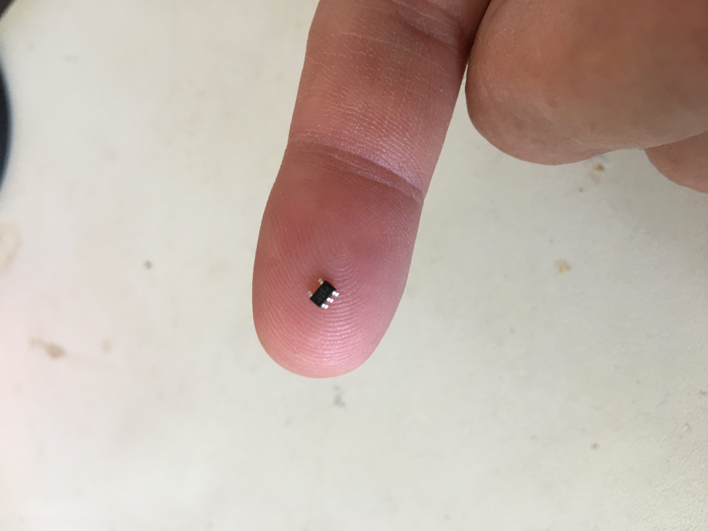

# Sensor module architecture

We'll divide the sensor module into three functional blocks.

1. The power supply subsystem
2. The CPU and LoRa transceiver - we'll call this the central subsystem
3. The sensor subsystem

This architecture should allow for swapping in different power supply types and different sensors, to create a wide range of sensor module functionality.

## The power supply subsystem

The electrical interface between the power supply and central subsystem is very simple and consists of three wires:

- Ground
- +3.3V @ 150 mA
- Voltage for battery monitoring. In systems without a battery this should be connected to +3.3V .

An on/off switch should be located on the power supply.

The mechanical interface should ideally be a connector and enclosure that allows direct connection of the power supply to the central subsystem so they physically become one unit, but can be separated (tools could be required).

## The central subsystem

This subsystem includes the CPU, LoRa transceiver, and an external SMA antenna connector.

The central subsystem has an electrical connection to the power supply subsystem, and a separate electrical connection to the sensor subsytem.

## The sensor subsystem

There are three main interfaces for sensors that we want to support.

1. I2C
2. SPI
3. One wire 

A connector that supports all of these would minimally have the following electrical connections (not necessarily in this order):

1. +3.3V
2. Ground
3. I2C SCL
4. I2C SDA
5. SPI MISO
6. SPI MOSI
7. SPI SCLK
8. SPI CS
9. One wire TX/RX

We may want to include some extra GPIO pins as well for future expansion.

Note that these interfaces are not designed for long cable lengths so the sensor subsystem would need to be close to or attached directly to the central subsystem. But in any case the sensor subsystem should have its own separable enclosure. The enclosure may be different depending on sensor type, but all sensor types should use the same interface to the central subsystem.

We also need a way for the central subsystem to determine which type of sensor is attached. There are several ways we could do this.

### ID method 1 - GPIO pins

We could simply add some GPIO pins to the connector and tie them low or high to encode the sensor type. If we use 3 pins we get a maximum of 8 different sensor types, if we use 4 pins we get 16 different types.

Requires: 3 or 4 GPIO pins.

### ID method 2 - Shift register

We could tie 3 GPIO pins to a 74HC165 shift register on the sensor subsystem (the three pins would be for Load, Clock, and Data). This would allow us to read an 8-bit value from the shift register, allowing 256 different sensor types.

A 74HC165 shift register costs 16 cents and is a basic part (JCLPCB pricing).

Requires: 3 GPIO pins and a 16 cent part.

UPDATE: It should be possible to use two of the SPI signals, SCLK and MISO, to read the 74HC165 as if it were a SPI device. Two GPIO signals are needed, a parallel load signal (ID PL) and a chip select signal (ID CS). If the sensor subsystem uses the SPI bus to talk to the sensor, the shift register output also needs to go through a tri-state buffer so it can share the SPI bus. A 74LVC1G125 tri-state buffer can be used for this purpose. If the sensor uses the I2C or One Wire interface and does not connect to the SPI bus, no tri-state buffer is needed.

Requires: 2 GPIO pins, a 16 cent basic part (74HC165), and a 7 cent extended part (74LVC1G125).

As an alternative, a 74HC589A shift register could be used. This device has a tri-state output on chip, and is an extended part that costs 32 cents. It also has a more complex latching mechanism with a separate latch clock that may require an extra GPIO line.

### ID method 3 - I2C EEPROM

Since we already have an I2C interface we could add an I2C EEPROM to the sensor subsytem. A 2Kbit M24C02-WMN6TP EEPROM costs 8 cents and is a basic part. It will store 256 bytes of data so in theory we could have up to 5 x 10<sup>154</sup> sensor types. :smiley:

Requires: An 8 cent basic part and no GPIO pins. But the EEPROM would need to be programmed for each sensor before it could be used. :grimacing:

### ID method 4 - I2C I/O expander

An I2C I/O expander such as the PCA9557 could be used to read up to an 8-bit value, allowing for 256 different sensor types. The PCA9557 costs 43 cents and is an extended part.

Requires: A 43 cent extended part and no GPIO pins.

### ID method 5 - Microcontroller in the sensor subsystem

Adding a microcontroller to the sensor subsystem looks great from an architecture perspective. The interface between the central subsystem and sensor subsystem could be reduced to a simple two-wire serial interface, and all of the I2C, SPI, or One Wire interfacing would happen within the sensor subsystem. The ID function would also be accomplished over the serial interface.

This approach is challenged from the cost, and more importantly, the power consumption perspective. A small microcontroller could be found for under a dollar, but these low cost microcontrollers tend to be power hungry, at least when compared to the low power STM32 processor variants. We could use another STM32 but this would cost $2-3 and essentially double our current power consumption.

### ID method conclusion

ID method 2 was selected. Here's the circuit including the tri-state buffer.


This circuit was first tested without the tri-state buffer. This circuit was found to work well and the ID could be read through the SPI interface, however the SPI interface does need to be set up with clock high when inactive (CPOL = 1) and data valid on clock leading edge (CPHA = 0). The code to do this is part of the hspi structure passed to the HAL_SPI_Init() function.

```
hspi1.Init.CLKPolarity = SPI_POLARITY_HIGH;
hspi1.Init.CLKPhase = SPI_PHASE_1EDGE;
```

After that the following code will read the ID into the buffer variable.

```
HAL_GPIO_WritePin (GPIOA, ID_PL_Pin, GPIO_PIN_RESET); /* Pull ID load signal low to prepare to load the shift register */
HAL_GPIO_WritePin (GPIOA, ID_PL_Pin, GPIO_PIN_SET);   /* Pull ID load signal high to load the shift register */
HAL_SPI_Receive(&hspi1, buffer, 1, 100);
```

Here's the logic analyzer signals as an ID of A5 hex was read from the shift register.


Once the tri-state buffer parts arrived the circuit was tested with the buffer in the circuit. This was a challenge to breadboard since this part is only available in a surface mount package.



It took two soldering attempts to successfully adapt this IC for breadboard work. It wasn't pretty, but it works.


In the end it all worked very well. Here's the code and resulting timing of the signals.

```
uint8_t ReadModuleID(void)
{
	uint8_t id;

	HAL_SPI_Receive(&hspi1, &id, 1, 100);				/* this read is just to initialize everything */
	HAL_GPIO_WritePin (GPIOA, ID_PL_Pin, GPIO_PIN_RESET); /* Pull ID load signal low to prepare to load the shift register */
	HAL_GPIO_WritePin (GPIOA, ID_PL_Pin, GPIO_PIN_SET);   /* Pull ID load signal high to load the shift register */
	HAL_GPIO_WritePin (GPIOA, ID_CS_Pin, GPIO_PIN_RESET); /* Pull CS signal low to gate signal onto SPI bus */
	HAL_SPI_Receive(&hspi1, &id, 1, 100);				/* read module ID */
	HAL_GPIO_WritePin (GPIOA, ID_CS_Pin, GPIO_PIN_SET); /* Pull CS signal high to release SPI bus */
	return(id);
}
```


